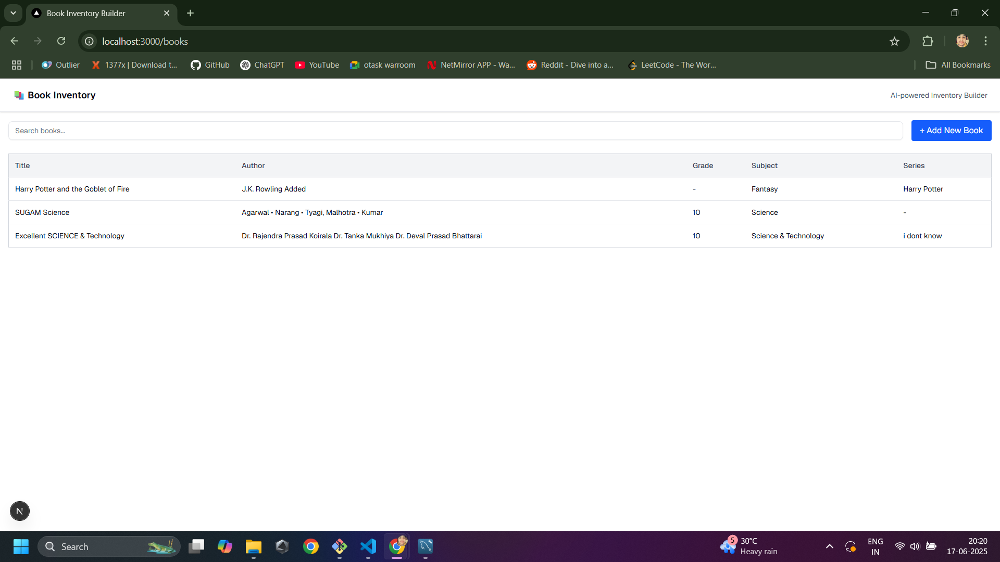
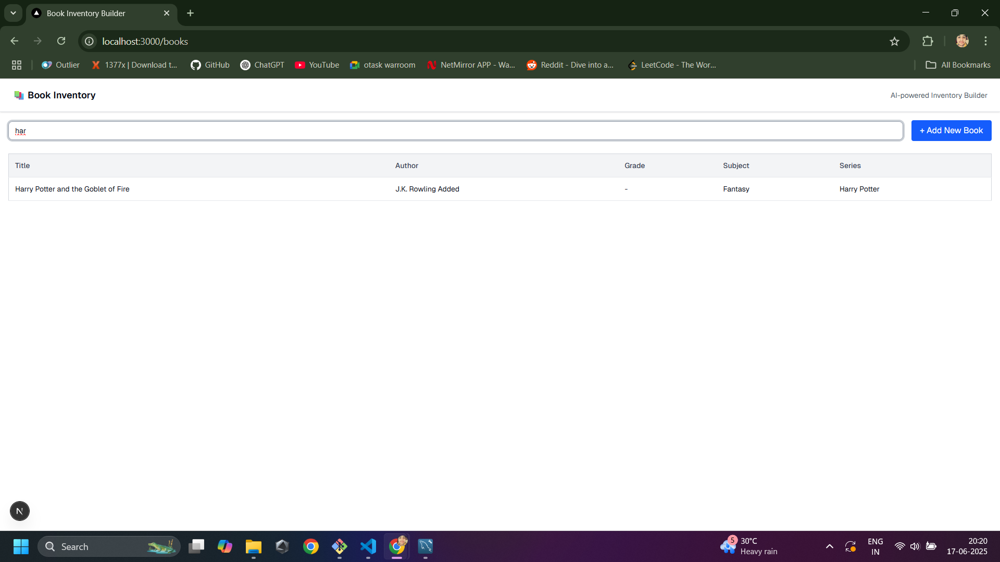
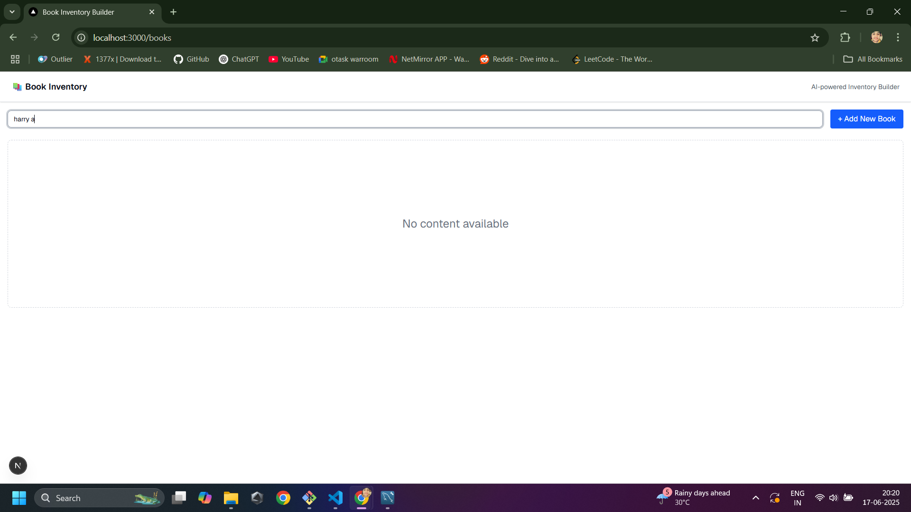
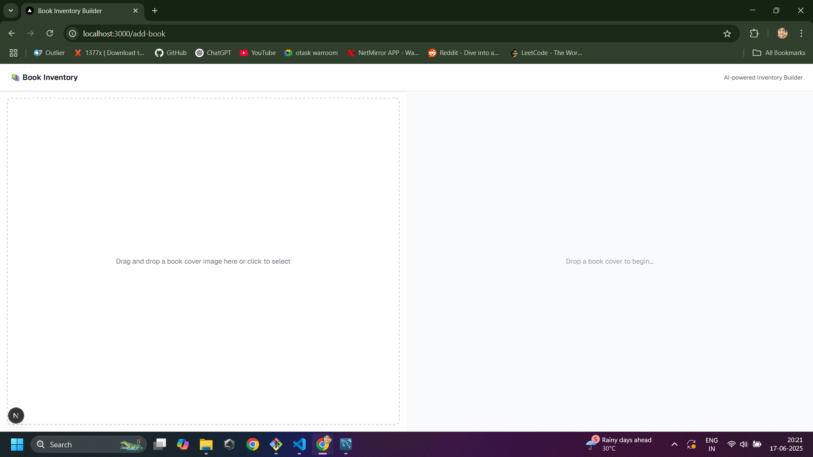
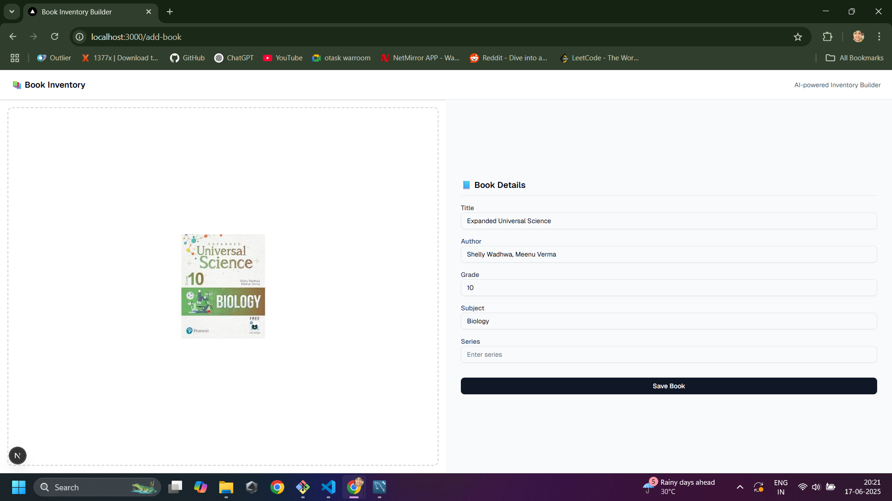

📚 Overview
Book Inventory Builder is a modern web application that helps users manage a collection of books with ease.

The app opens with a Home Page that displays the complete list of books. Users can search for specific titles using the built-in search bar. A prominent “Add New Book” button allows users to add new entries to the library.

On clicking the “Add New Book” button, users are navigated to a dedicated page with a two-part layout:

Image Drop Section – Users can drag and drop a book cover image.

Auto-Filled Form Section – After dropping the image, it gets displayed, and a form appears automatically populated with book details (like title, author, grade, etc.) using the Gemini Vision API.

Users can edit these fields before saving the book. Once saved, the book is stored in the database and the user is redirected back to the Home Page, where the new entry becomes visible in the list.

## ⚙️ Setup

Follow the steps below to run this project locally:

### 1. **Clone the Repository**

```bash
git clone https://github.com/baggarwal8799/book-inventory-builder
cd book-inventory-builder
```

### 2. **Install Dependencies**

```bash
npm install
# or
yarn install
```

### 3. **Configure Environment Variables**

Create a `.env.local` file at the root of the project and add the following:

```env

GEMINI_API_KEY=<!-- your gemini key -->
DB_HOST=localhost
DB_PORT=3306
DB_USER=db user
DB_PASSWORD=db password
DB_NAME=book_inventory
NEXT_PUBLIC_BASE_URL=http://localhost:3000

```

You can refer to `.env.example` for structure.

### 4. **Set Up the Database**

Refer to entities\db\schema.sql:

- Ensure your DB is running.
- Use schema sql file for schema.
- Add DB credentials in your database connection config.

### 5. **Run the Development Server**

```bash
npm run dev
# or
yarn dev
```

Visit [http://localhost:3000](http://localhost:3000) in your browser. It will redirect you to http://localhost:3000/books.

## 📸 Screenshots

### 🏠 Home Page
Displays the list of all books with search functionality and a button to add a new book.  


### 🔍 Search Result
Books filtered based on the search input.  


### 🚫 No Content
Shown when no books are found in the system or for the search keyword.  


### ➕ Add Book Page (Initial)
Add book page.  


### 🔄 Gemini Result Loading
Page gets filled with data after dropping the image.


### 📝 Auto-filled Book Form
Redirected to main page with success message.


## 🛠 Tech Stack

- **Framework**: Next.js 15
- **Database**: MySQL
- **Styling**: Tailwind CSS
- **AI Integration**: Gemini Vision API
